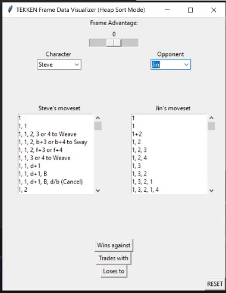

# TEKKEN 7 Frame Data Visualizer 
1st Place Winner for Best Project in DSA (Spring 2021)  
[YouTube] https://youtu.be/gzzWb-8H6vg  
<br/>
  
*** __Goal__ ***  
This project aims to solve the ongoing issue of understanding frame data in the video game TEKKEN 7 
by using an interactive GUI that presents the necessary information in a user-friendly manner.    
  <br/>
  
*** __Setup__ ***  
To use the TEKKEN Frame Data Visualizer interface, you will need to download all files in the repository.
Make sure all files are located in the same directory. Then, run ```main.py``` using your preferred Python compiler.  
  <br/>  

*** __Usage__ ***  
To maximize the interface's use, ensure you follow the steps below.
- You will need to first choose your character and the opponent's character from the dropdown menus.
- To find the properties of a given move, find and click the notation of the move in the moveset listbox.
- Adjust your character's *frame advantage* accordingly using the slider at the top of the interface.
- Press the respective buttons to calculate the subset of your opponents moves that your selected move
  *wins against*, *trades with*, or *loses to*, sorted ascendingly in order of *startup frames*.
- For more immersion, you can modify the sort method from the default *heap sort* [O(n·logn)] to *insertion sort* [O(n<sup>2</sup>)]
  by changing the true/false values of the respective boolean variables in the first few lines of ```main.py```.  
    <br/>
 
<p align="center">
  
</p>
    
*** __Additional Resources__ ***  
Check out these videos for a more in-depth explanation on TEKKEN fundamentals and frame data:  
- General Beginner's Guide: https://www.youtube.com/watch?v=K-WhR09Q6TU  
- Frame Data Explained: https://www.youtube.com/watch?v=Wtfdx3sZE18  
- Movement Tips and Strategies: https://www.youtube.com/watch?v=Lbm5CasGsMQ  
- The "Korean Backdash": https://www.youtube.com/watch?v=dzIfubaQLyk  
 <br/>
All data comes from the following resource:  
 https://tekkenframes.qatarfgc.com/
